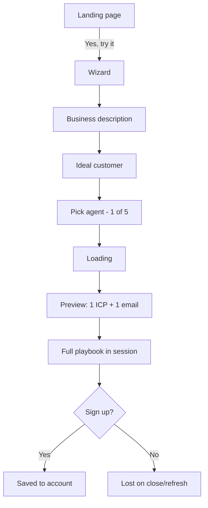

# Simple Outreach App — Design Spec

**Date:** 2026-06-01  
**Status:** Approved  
**Project:** `outreach-app`

## Summary

A fifth-grader-simple web app that helps small business owners get an **email outreach playbook** in under five minutes. Users land on a marketing page, opt into a short wizard, pick one of five writing “agents,” see proof it works (one example prospect + one sample email), then get a full drip plan they can copy. Nothing is sent from the app. Plans are **session-only** until the user signs up to save.

## Goals

| Goal | Success metric |
|------|----------------|
| Speed | First-time user: landing → full playbook in **≤ 5 minutes** |
| Simplicity | Plain language, minimal fields, one primary action per screen |
| Trust | User sees **1 ICP example + 1 email** before scrolling to full plan |
| Scope (v1) | Email only; no sending, CRM, or lead import |

## Non-goals (v1)

- Sending email from the product
- LinkedIn or multi-channel outreach
- Real lead scraping or “verified” contacts
- Reply tracking / inbox
- Payments
- CRM integrations

## User flow



### Screen 0 — Landing

- **Headline:** Plain benefit (e.g. “Get a simple plan to email the right customers.”)
- **Bullets (2–3):** Who to email, what to write, follow-up emails
- **Primary CTA:** “Yes, let me try it” / “Try it free” → enters wizard
- **Optional:** “See how it works” — smooth-scroll to animated timeline (`#how-it-works`)
- **How it works section:** Dark band with scroll-scrubbed glowing vertical line (purple → blue), five steps alternating left/right, cards fade/slide in as each step enters view (Framer Motion). Steps match product flow: business → customer → agent → preview → full plan.

### Screens 1–3 — Wizard (single-page panels)

1. **Business** — one text field: “What do you sell or do?” + one-line example
2. **Ideal customer** — one text field: “Who do you want to email?” + example
3. **Agent** — five large selectable cards (see agents table)

### Screen 4 — Proof (preview)

- Loading state (~10–15s) with friendly steps: “Finding someone to email…”, “Writing your first message…”
- **ICP card (example):** name, title, company type, 2 bullets “why they fit”
- **Disclaimer:** “Example person — not a real contact we found online”
- **Sample email:** subject + body, **Copy** button

### Screen 5 — Full playbook (same visit)

- **Who to look for:** 3–5 ICP trait bullets
- **Where to find emails:** simple tactics (Google, directories, company sites, etc.)
- **3-email drip:** Day 1 / Day 4 / Day 8 (labels only; user sends manually)
- Each email: subject + body in selected agent voice
- **Copy** per block + **Copy all**
- **Sticky bar:** “Sign up to save this plan” + note that leaving may lose work

### Signup & persistence

| Capability | Guest (session) | Signed in |
|------------|-----------------|-----------|
| Complete wizard | Yes | Yes |
| See preview + full playbook | Yes | Yes |
| Copy content | Yes | Yes |
| Survive refresh / return later | No | Yes |
| List past plans | No | Yes (simple list) |

**Auth:** Email + password or “Continue with Google” — one screen, no extra onboarding.

## Five agents

| ID | Name | One-liner | Tone hint for prompts |
|----|------|-----------|------------------------|
| `warm` | Warm & helpful | Sounds like a friend who wants to help | Supportive, low pressure |
| `punchy` | Short & punchy | Few words, straight to the point | ≤ 120 words, no fluff |
| `formal` | Professional & formal | Polished and businesslike | Complete sentences, no slang |
| `curious` | Curious question-asker | Opens with a question, not a pitch | Lead with question, soft CTA |
| `urgent` | Urgent & direct | Clear reason to reply soon | Time-bound, direct CTA |

Each agent affects: preview email, all three drip emails, and subject lines.

## AI generation contract

**Endpoint:** `POST /api/generate` (edge/serverless)

**Request:**

```json
{
  "business": "string",
  "idealCustomer": "string",
  "agentId": "warm | punchy | formal | curious | urgent"
}
```

**Response:**

```json
{
  "icpExample": {
    "name": "string",
    "title": "string",
    "companyType": "string",
    "whyFit": ["string", "string"]
  },
  "sampleEmail": { "subject": "string", "body": "string" },
  "icpTraits": ["string"],
  "findLeadsTips": ["string"],
  "drip": [
    { "dayLabel": "Day 1", "subject": "string", "body": "string" },
    { "dayLabel": "Day 4", "subject": "string", "body": "string" },
    { "dayLabel": "Day 8", "subject": "string", "body": "string" }
  ]
}
```

**Rules enforced in prompt:**

- Example ICP must be plausible fiction, not presented as scraped data
- One clear CTA per email
- No fake statistics or “I saw your post” unless user provided context
- Output must be valid JSON only

## Architecture (v1 — Approach 2)

- **Frontend:** Vite + React + TypeScript, single SPA
  - Views: `landing` | `wizard` | `results`
  - Guest plan in `sessionStorage` key `outreach-plan`
- **API:** One generate function; optional `save-plan` after auth
- **Auth + DB:** Supabase (auth + `plans` table) or equivalent
- **Deploy:** Static host + serverless/edge (Vercel recommended)
- **Styling:** CSS variables, large type, single column, high contrast, minimal chrome

## Data model (saved plans)

```sql
plans (
  id uuid primary key,
  user_id uuid references auth.users not null,
  business text not null,
  ideal_customer text not null,
  agent_id text not null,
  plan_json jsonb not null,
  created_at timestamptz default now()
)
```

## Error handling

- Generate failure: retry button + “Keep your answers” (don’t clear wizard)
- Rate limit: friendly message, try again in a minute
- Auth errors: inline on signup modal
- Session warning on `beforeunload` if plan exists and user not signed in

## Accessibility & UX

- All actions keyboard-reachable
- Loading state is announced (`aria-live`)
- Agent cards: `role="radio"` in a group
- Minimum tap targets 44px
- Reading level: ~5th grade (short sentences, no jargon)

## Security

- API keys server-side only
- Supabase RLS: users read/write only their `plans`
- No PII required beyond auth email
- Optional: basic rate limit on `/api/generate` by IP

## Future (post-v1)

- Export PDF
- More than one saved plan dashboard
- Connect Gmail to send
- A/B subject line variants per agent

## Open decisions (defaults for build)

| Decision | Default |
|----------|---------|
| Product name on landing | “Outreach Coach” (placeholder) |
| LLM provider | OpenAI via server env `OPENAI_API_KEY` |
| Hosting | Vercel |
